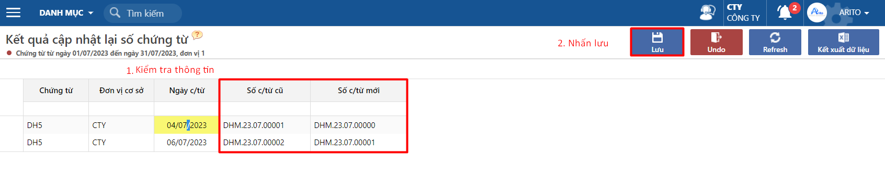

---
layout:
  title:
    visible: true
  description:
    visible: false
  tableOfContents:
    visible: true
  outline:
    visible: true
  pagination:
    visible: false
---

# Cách đánh lại số chứng từ

Trong quá trình nhập liệu do có chỉnh sửa số liệu đôi khi có trường hợp nhảy số chứng từ không theo thứ tự tăng dần, hoặc không sắp xếp theo ngày tăng dần.

Tài liệu hướng dẫn người dùng thao tác cập nhật lại số chứng từ tăng dần theo ngày dựa vào khai báo định dạng theo quyển chứng từ cũ hoặc mới.

## Hướng dẫn thao tác

**Bước 1.** Vào chức năng cập nhật số chứng từ tại đường dẫn _**Hệ thống/ Tiện tích và kiểm tra số liệu/ Cập nhật lại số chứng từ,**_ chọn thông tin Chứng từ sử dụng mã quyển cần cập nhật.

<figure><figcaption></figcaption></figure>

**Bước 2.** Kiểm tra đúng thông tin cần cập nhật và nhấn lưu.

<figure><figcaption></figcaption></figure>

**Bước 3.** Trường hợp muốn trả lại về trước khi cập nhật chọn **Undo**.

<figure><figcaption></figcaption></figure>

**Các lưu ý:**

* Nếu chứng từ đang có quy tắc nhảy theo tháng (qua tháng mới thì reset lại số) thì phải chạy cập nhật từng tháng. Do đó khi tạo quyển chứng từ thì căn cứ vào số lượng chứng từ phát sinh để có đánh số theo tháng hay không, nếu ít thì nên đánh theo năm.
