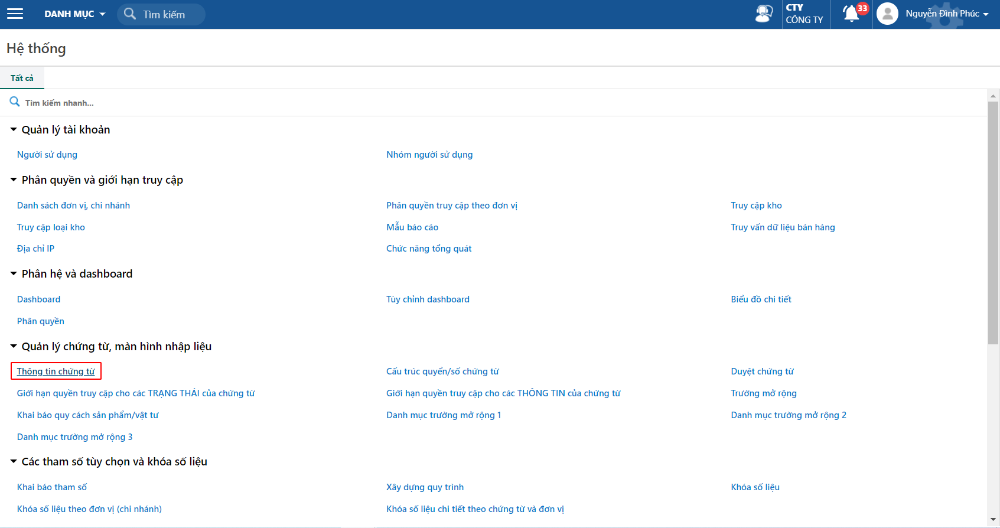
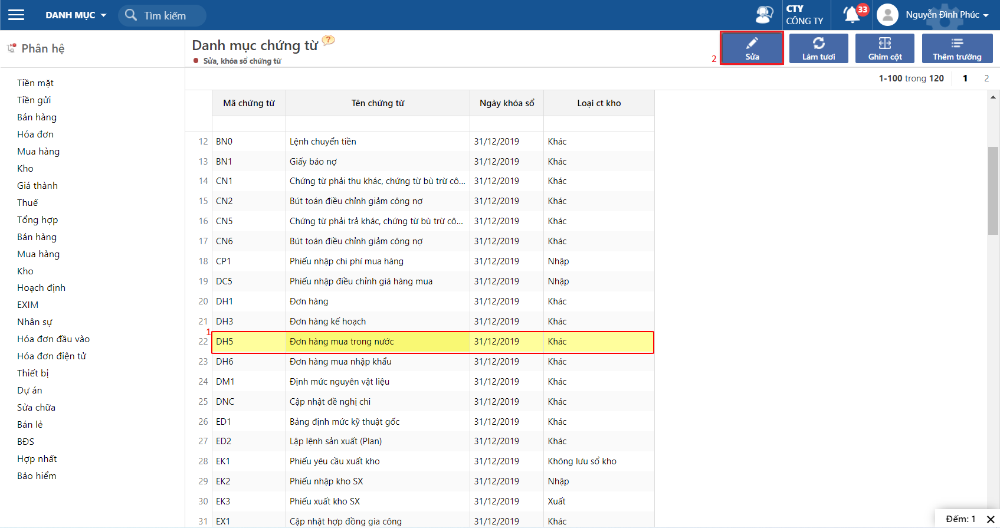
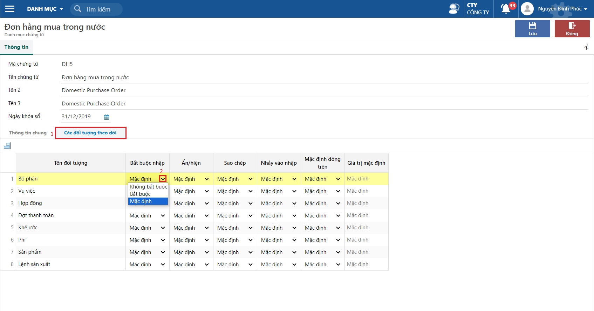
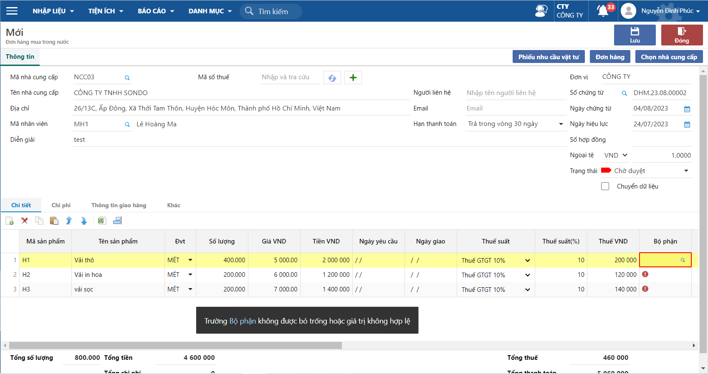
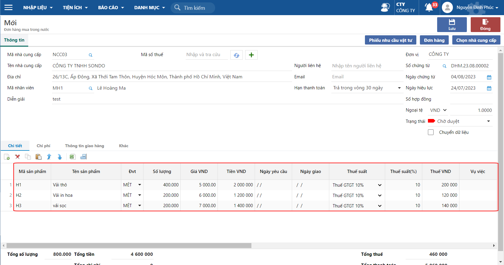
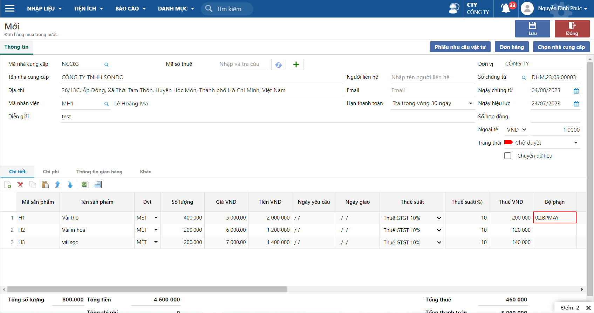
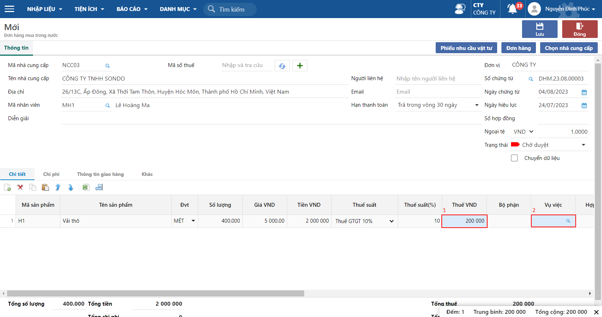

---
layout:
  title:
    visible: true
  description:
    visible: false
  tableOfContents:
    visible: true
  outline:
    visible: true
  pagination:
    visible: true
---

# Khai báo các trường mặc định, ẩn hiện, bắt buộc trên chứng từ

## Hướng dẫn thao tác

**Bước 1:** Vào chứng năng Hệ thống, chọn Thông tin chứng từ

Đường dẫn: Hệ thống/ Quản lý chứng từ, màn hình nhập liệu/ Thông tin chứng từ

<figure><figcaption>
Thông tin chứng từ
</figcaption></figure>

**Bước 2:** Chọn chứng từ muốn thay đổi thông tin

<figure><figcaption>
Danh mục chứng từ
</figcaption></figure>

**Bước 3:** Tại Tab các đối tượng theo dõi, thay đổi các thông tin của các cột&#x20;

<figure><figcaption>
Danh mục chứng từ: Đơn hàng mua
</figcaption></figure>

Giải tích các cột Bắt buộc nhập, Ẩn/ hiên, Sao chép, Nhảy vào nhập, Mặc định dòng trên, Giá trị mặc định

* Bắt buộc nhập:&#x20;

Có các lựa chọn như Bắt buộc, Không bắt buộc (bắt buộc/ không bắt buộc nhập cột này trên chứng từ) và Mặc định (mặc định không bắt buộc nhập trên chứng từ)

ví dụ: Chọn Bắt buộc nhập thì khi tao đơn hàng phải bắt buộc nhập trường Bộ phận

<figure><figcaption>
Đơn hàng mua trong nước
</figcaption></figure>

* Ẩn/ hiện:&#x20;

Có các lựa chọn như ẩn, hiện và mặc định (nếu chọn ẩn/ hiện thì cột đó sẽ ẩn đi hoặc hiển thị trên chứng từ, nếu chọn mặc định thì trường tương ứng sẽ hiển thị trên chứng từ)

ví dụ: chọn Ẩn cột Bộ phận

<figure><figcaption>
Đơn hàng mua trong nước
</figcaption></figure>

* Sao chép:&#x20;

Có các lựa chọn như có, không và mặc định (nếu chọn có/ không thì cột đó sẽ có/ không sao chép dữ liệu khi chọn nút sao chép trên màn hình nhập liệu, nếu chọn mặc định thì trường tương ứng sẽ mặc đinh sao chép dữ liệu)

ví dụ: chọn có sao chép

<figure><figcaption>
Đơn hàng mua trong nước
</figcaption></figure>

* Nhảy vào nhập:&#x20;

ví dụ: chọn không nhảy vào nhập

Có các lựa chọn như có, không và mặc định (nếu chọn có/ không thì khi nhập liệu trên chứng từ bằng nút Tab hoặc nút Enter thì sẽ có/ không nhảy qua trường được điều chỉnh, nếu là mặc định là có nhảy vào để nhập liệu)

<figure><figcaption>
Đơn hàng mua trong nước
</figcaption></figure>

* Mặc định dòng trên

Có các lựa chọn như có/ không và mặc định (nếu chọn có/ không thì khi thêm mới dòng ở chi tiết thì dòng dưới sẽ mặc định có/ không gán giá trị dữ liệu của dòng trên, nếu là mặc định là có)

ví dụ: có mặc định dòng trên

<figure><figcaption>
Đơn hàng mua trong nước
</figcaption></figure>
