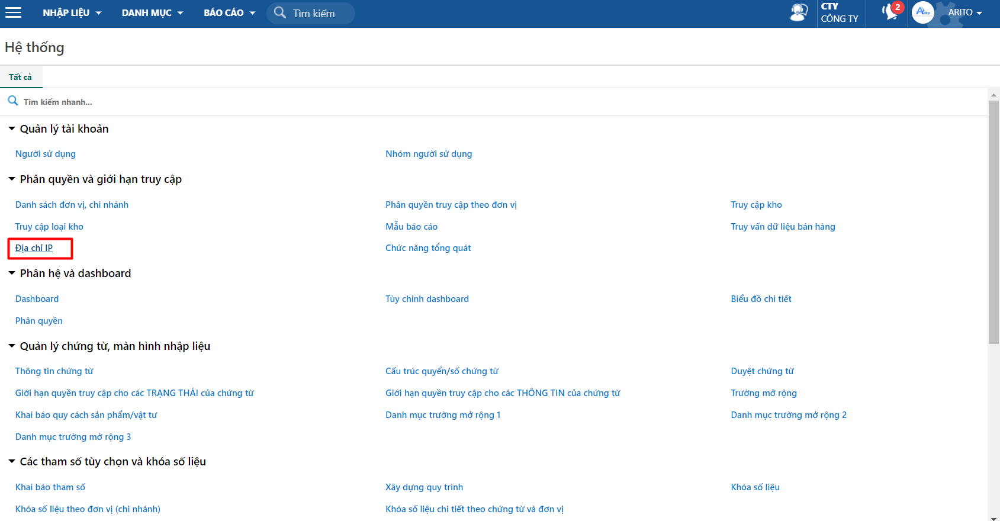

---
layout:
  title:
    visible: true
  description:
    visible: false
  tableOfContents:
    visible: true
  outline:
    visible: true
  pagination:
    visible: false
---

# Phân quyền truy cập theo địa chỉ IP

Tài liệu mô tả thao tác phân quyền cho phép hoặc giới hạn IP mà người dùng có thể truy cập phần mềm.

## Hướng dẫn thao tác

### Phân quyền truy cập theo địa chỉ IP

**Bước 1:** Vào đường dẫn: _**Hệ thống/ Phân quyền và giới hạn truy cập/ Địa chỉ IP.**_

<figure><figcaption>
Đường dẫn
</figcaption></figure>

**Bước 2:** Chọn vào user cần phân quyền và nhấn **Phân quyền** trên thanh công cụ.

**Bước 3:** Chọn địa chỉ IP giới giạn hoặc IP cho phép truy cập và nhấn **Lưu**.

<figure><figcaption>
Phân quyền truy cập theo địa chỉ IP
</figcaption></figure>
