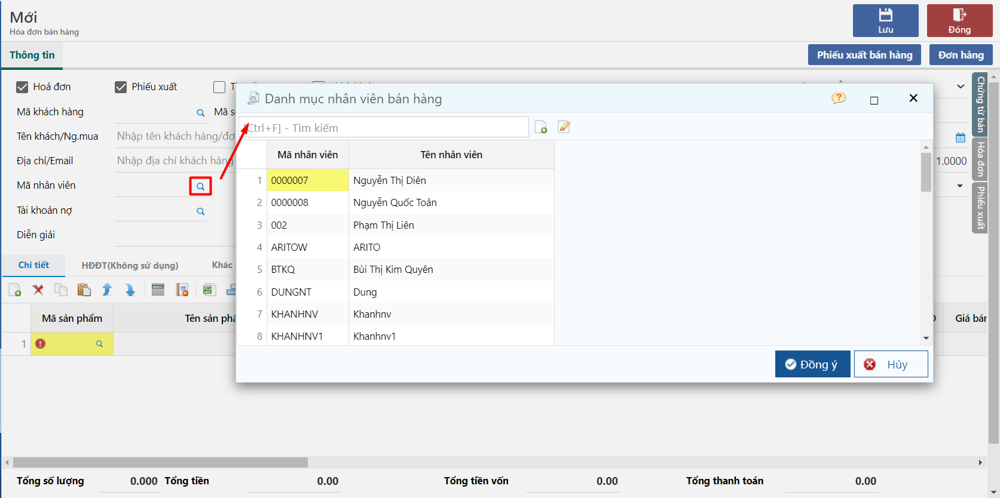
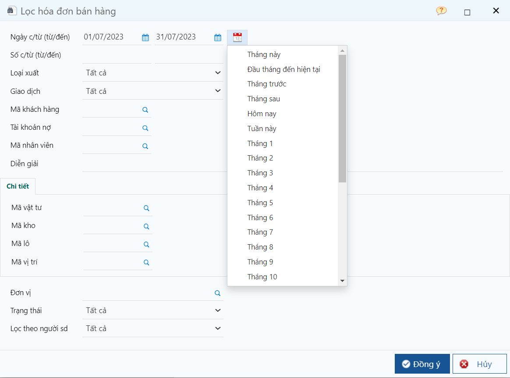

---
layout:
  title:
    visible: true
  description:
    visible: false
  tableOfContents:
    visible: true
  outline:
    visible: true
  pagination:
    visible: false
---

# Các thao tác sử dụng

## Trình duyệt sử dụng, đánh dấu trang

Các trình duyệt và phiên bản khuyến cáo để có thể sử dụng tốt chương trình, tuy nhiên, người dùng có thể nâng cấp các phiên bản mới hơn.

* Firefox
* Chrome
* Safari
* Opera
* Và nhiều trình duyệt khác…

Đánh dấu trang: người dùng có thể nhấn vào nút bên dưới hình để lưu lại trang làm việc.

<figure><figcaption>
Đánh dấu trang
</figcaption></figure>

## Đăng nhập/Huỷ phiên làm việc

Chương trình được phát triển trên nền web (web application) do đó trong một thời điểm sử dụng, mỗi trình duyệt sẽ tương đương 1 phiên làm việc. Trong trường hợp tạm thời dừng làm việc nên đăng xuất khỏi chương trình để thực sự thoát phiên làm việc. Tuy nhiên, nếu không đăng xuất thì trong khoảng thời gian nhất định (khai báo cấu hình hệ thống) chương trình sẽ tự ngắt kết nối, khi đó cần nhập mật mã đăng nhập trở lại.

**Lưu ý:**

* Chương trình không cho phép một người dùng đăng nhập 2 lần - nghĩa là nếu đã đăng nhập rồi thì không thể dùng mã người dùng (user) vừa đăng nhập để vào chương trình được nữa.
* Muốn truy nhập lại user tại máy khác (hoặc trình duyệt khác) thì phải nhấn Đăng xuất (Logout);
* Trên một máy trạm, chỉ cho phép một người dùng đăng nhập. Trong trường hợp truy nhập lại user tại máy khác (hoặc trình duyệt khác) máy sẽ hỏi người dùng có tắt phiên làm việc cũ hay không, nếu có, sau khi chấp nhận thì phiên làm việc cũ bị mất hiệu lực hoàn toàn.

<figure><figcaption></figcaption></figure>

* Khi nhập mật khẩu chú ý kiểm tra phím Casplock nếu không đăng nhập được vì chương trình có xét chữ hoa chữ thường trong mật khẩu.
* Ngoài ra nên kiểm tra bộ gõ tiếng Việt đã cấu hình đúng theo yêu cầu chưa. Tùy theo bộ gõ, tùy theo cách gõ của người dùng có thể dẫn đến mật khẩu bị nhập sai.

<figure><figcaption>
Màn hình đăng nhập
</figcaption></figure>

* Trong quá trình sử dụng chương trình, nếu có bị mất kết nối với máy chủ, khi làm việc lại thì chương trình sẽ hiện bảng yêu cầu gõ lại Mật khẩu để đăng nhập lại, user mặc định là user đang sử dụng chương trình.

<figure><figcaption></figcaption></figure>

## Đăng nhập với giao diện tiếng Anh

Khi cần làm việc với giao diện tiếng Anh, khi truy nhập chương trình cần chọn ngôn ngữ tiếng Anh hoặc tiếng Việt, chọn trên màn hình đăng nhập, trên góc phải của chương trình.

<figure><figcaption></figcaption></figure>

Ngoài ra, người dùng có thể thay đổi giao diện Tiếng Anh trong quá trình sử dụng mà không cần phải đăng xuất ra bên ngoài để thay đổi. Người dùng nhấn vào nút **Ngôn ngữ và hệ thống**

<figure><figcaption></figcaption></figure>

<figure><figcaption></figcaption></figure>

## Đổi mật khẩu khi đăng nhập lần đầu

Khi người dùng được quản trị viên cung cấp một tài khoản mới, để đảm bảo tính bảo mật, khi đăng nhập lần đầu phần mềm cho phép người dùng thay đổi mật khẩu - mật khẩu phải có ít nhất 8 kí tự.

<figure><figcaption>
Màn hình đổi mật khẩu
</figcaption></figure>

Sau khi đổi mật khẩu thành công, màn hình sẽ hiện thông báo như hình bên dưới. Những lần đăng nhập sau người dùng sẽ không phải thay đổi mật khẩu như lần đầu đăng nhập.

<figure><figcaption>
Màn hình cập nhật mật khẩu thành công
</figcaption></figure>

## Mở cửa sổ (Tab) mới

Khi cần làm việc với nhiều tác vụ khác nhau (multi task), người dùng có thể thao tác như sau:

* Sao chép địa chỉ đường dẫn hiện tại, mở 1 trang hoặc 1 cửa sổ trình duyệt mới, dán vào ô địa chỉ và mở trang;
* Với trình duyệt FireFox, Chome, Opera: nhấn chuột phải vào menu và chọn “Mở liên kết trong tab mới” hoặc “Mở liên kết bằng cửa sổ mới”;

<figure><figcaption></figcaption></figure>

## Thao tác với các trường mã

Nhập trực tiếp để tìm kiếm 1 mã danh điểm, nhập 3 ký tự, chương trình sẽ xem danh mục để chọn

Chương trình sẽ tìm trong bộ mã trước tiên.

Ví dụ nếu nhập "TH" thì chương trình sẽ thể hiện: TH01, TH02

Tiếp sau, nếu không tìm thấy trong bộ mã, chương trình sẽ tìm trong trường tên của danh mục miễn có chứa cụm từ "TH" như thiết bị, áo thun,...

Lưu ý là đối với các trường danh mục có những báo cáo bắt buộc phải nhập toàn bộ mã (điều kiện tuyệt đối) nhưng cũng có những báo cáo chỉ cần nhập những ký tự đại diện (điều kiện tương đối)

<figure><figcaption></figcaption></figure>

Hoặc nhấn biểu tượng kính lúp  để tra cứu trong danh sách. Sau khi danh sách hiện ra thì thực hiện các thao tác lọc tìm.

<figure><figcaption></figcaption></figure>

## Thao tác với trường ngày tháng

Các trường đối tượng ngày tháng có dấu hiệu chọn tìm ngày bên phải đối tượng. Có thể nhập trực tiếp giá trị ngày tháng hoặc nhấn vào dấu hiệu  để chọn ngày thích hợp.

Trong cửa sổ ngày tháng, chỉ chọn được ngày. Nếu chọn tháng, năm, để chọn nhanh cần kích chuột vào vị trí "tháng, năm" (phải, phía trên), chương trình sẽ cho chọn tháng, năm.

Ngoài ra, còn 1 cách tiện hơn là phía sau trường Ngày từ đến click vào nút 3 chấm sẽ hiện lên bảng để chọn nhanh ngày điều kiện lọc: Tháng này, Tháng sau, Tháng 1…

<figure><figcaption></figcaption></figure>

