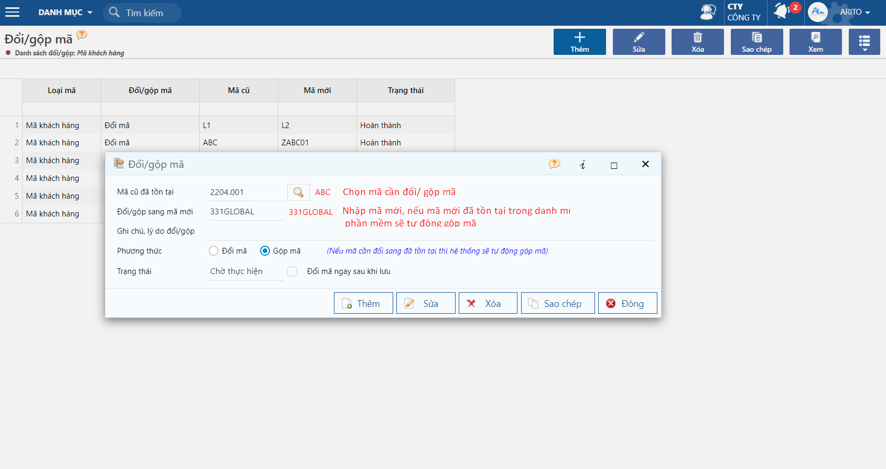
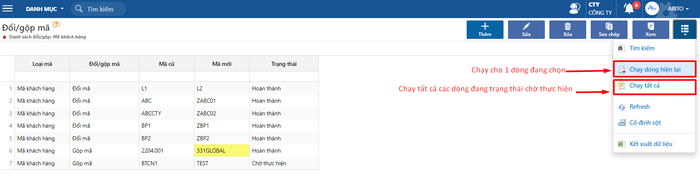

---
layout:
  title:
    visible: true
  description:
    visible: false
  tableOfContents:
    visible: true
  outline:
    visible: true
  pagination:
    visible: false
---

# Cách đổi mã/ gộp mã khi đã có phát sinh

Trong quá trình nhập liệu, khi người dùng có nhu cầu sửa 1 mã vật tư, khách hàng, nhà cung cấp, ... đã có phát sinh và không thể sửa trực tiếp trên phần mềm.

Các tình huống đổi mã mà phần mềm hỗ trợ:

* Đổi mã: Đổi 1 mã chưa đã có trên hệ thống sang 1 mã mới hoàn toàn. Tình huống này xảy ra khi sơ suất tạo sai quy cách đặt mã hoặc doanh nghiệp cần thay đổi quy cách đặt mã.
* Gộp mã: 2 mã có trên hệ thống và muốn gộp 2 mã này thành 1. Tình huống này xảy ra khi cùng 1 đối tượng mà người dùng tạo ra 2 mã trên hệ thống và muốn gộp lại thành 1 mã duy nhất để theo dõi.

## Hướng dẫn thao tác

**Bước 1.** Truy cập vào chức năng đổi mã tại đường dẫn: _**Hệ thống/ Tiện tích và kiểm tra số liệu/ Đổi mã.**_ Chọn loại mã cần đổi/ gộp mã.

<figure><figcaption></figcaption></figure>

**Bước 2.** Nhấn nút Thêm và khai báo thông tin cần đổi/ gộp

<figure><figcaption></figcaption></figure>

Phương thức: Mặc định sẽ là đổi mã cũ sang mới mới, nếu mã mới đã tồn tại trong danh mục khai báo thì phần mềm sẽ tự động gộp mã cũ và mã mới đã có trong phần mềm.

**Bước 3.** Sau khi khai báo xong, chọn vào dòng cần đổi/ gộp mã và tiến hành chạy Đổi/ gộp mã.

<figure><figcaption></figcaption></figure>

Sau khi chương trình thực hiện xong, mã được đổi sẽ bị xóa trong hệ thống và các phát sinh của mã này sẽ chuyển qua mã mới.

