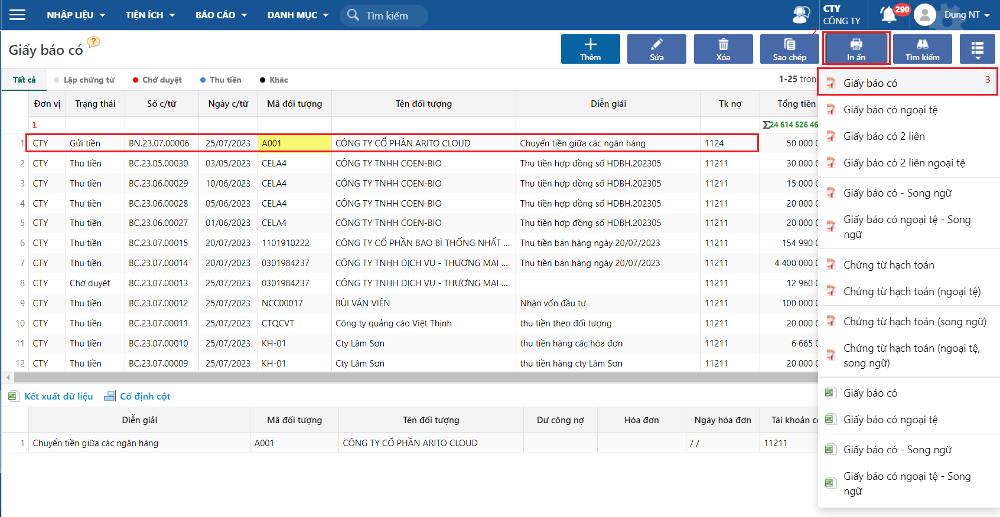
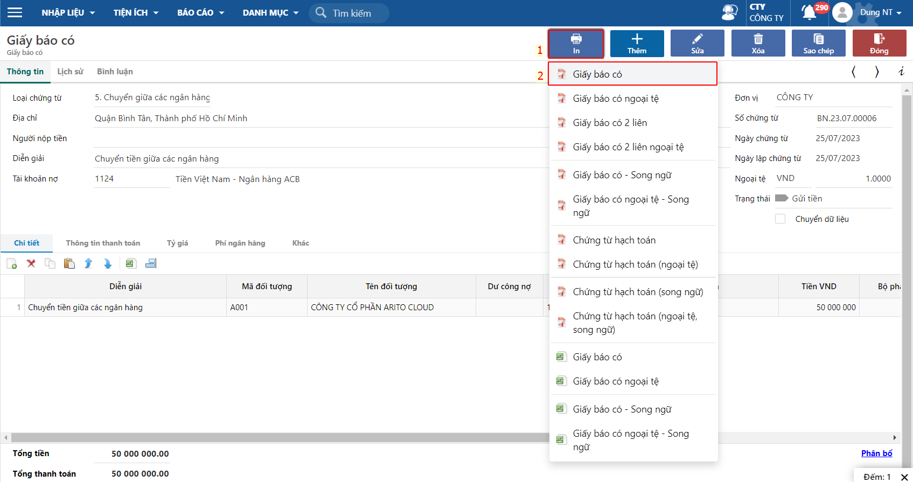
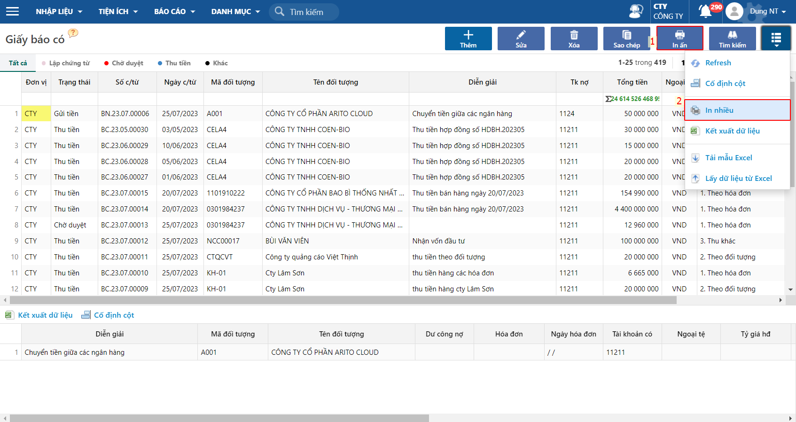
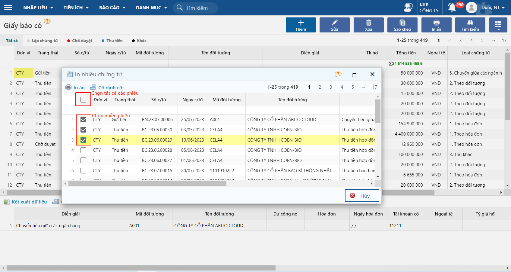
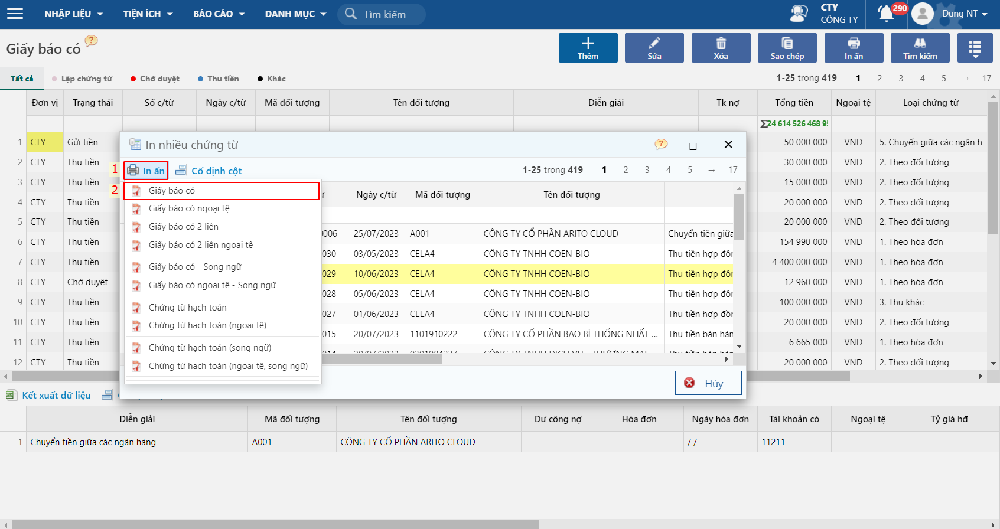
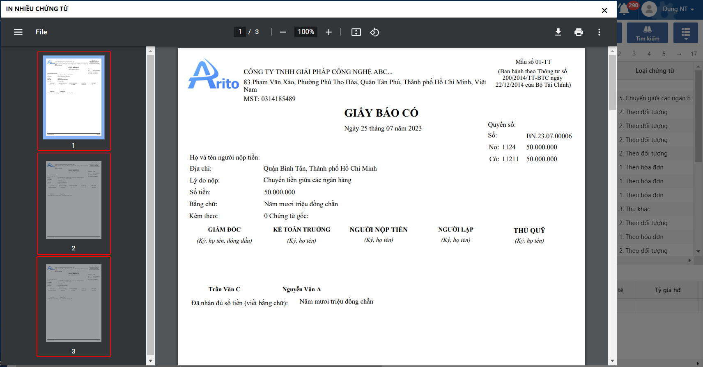

# Cách in chứng từ (in 1, in nhiều)

## **Mục đích**

* Để tạo ra các bản sao giấy của các chứng từ, giúp cho việc lưu trữ, xử lý và truy xuất thông tin dễ dàng hơn.
* Khi in nhiều chứng từ cùng một lúc, tiết kiệm được thời gian và chi phí so với việc in từng chứng từ một cách riêng lẻ
* Giúp giảm thiểu sự cố sai sót trong quá trình in, đồng thời đảm bảo tính chính xác và đồng bộ giữa các bản sao chứng từ.

## **Hướng dẫn thao tác**

Ví dụ: Chọn Giấy báo có để in 1/ in nhiều

Đường dẫn: _**Tài chính/ Tiền gửi/ Giấy báo có**_

#### 1. In 1

Cách 1:

Thao tác như sau: Chọn phiếu muốn in Click vào nút in Chọn mẫu in

Cách 2: In tại phiếu Click vào nút in Chọn mẫu in

#### 2. In nhiều

Bước 1: Chọn in nhiều

Bước 2: Chọn các phiếu để in nhiều

Bước 2: Hover chuột vào nút In ấn và chọn mẫu để in

Bước 3: Kiểm tra các phiếu được in

