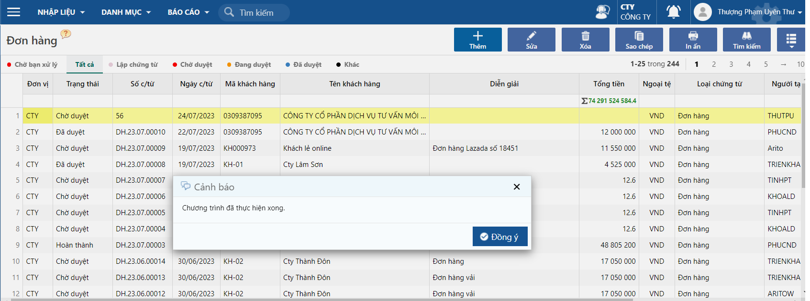
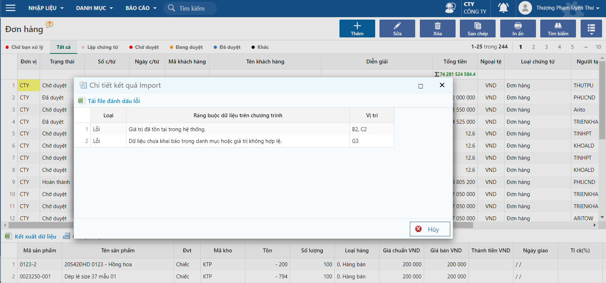

---
layout:
  title:
    visible: true
  description:
    visible: false
  tableOfContents:
    visible: true
  outline:
    visible: true
  pagination:
    visible: false
---

# Import dữ liệu từ excel vào chương trình

Trong quá trình nhập liệu người dùng cần đưa dữ liệu hàng loạt từ excel vào chương trình nhằm tiết kiệm thời gian. Tài liệu sẽ hướng dẫn người dùng thực hiện thao tác đưa dữ liệu hàng loạt vào chương trình.

## Các bước thực hiện

Ở thao tác này, Arito sẽ lấy Đơn hàng làm mẫu, người dùng dựa vào tài liệu này để thực hiện tương tự cho các chứng từ khác.

**Bước 1.** Tải mẫu excel từ phần mềm: Người dùng truy cập vào màn hình chứng từ muốn đưa dữ liệu lên, bấm vào nút **Tải mẫu excel,** lúc này phần mềm sẽ tự động tải mẫu excel về.

<figure><figcaption>
Tải mẫu excel
</figcaption></figure>

**Bước 2.** Nhập dữ liệu vào mẫu excel

File excel tải về thường sẽ được lưu tại mục Downloads của máy tính.

<figure><figcaption></figcaption></figure>

**Lưu ý:**&#x20;

* Khi nhập dữ liệu, người dùng cần nhập đầy đủ và đúng định dạng dữ liệu theo ghi chú ở từng cột.
* Người dùng có thể nhập dữ liệu của nhiều đơn hàng khác nhau nhưng phải đảm bảo mỗi chứng từ chỉ tương ứng với một mã khách hàng.
* Các dữ liệu được tạo trước như mã khách hàng, mã nhân viên, mã sản phẩm,... phải đảm bảo được nhập đúng.

**Bước 3.** Đưa dữ liệu vào phần mềm: sau khi đã nhập liệu, người dùng tiến hành thực hiện thao tác đưa dữ liệu vào phần mềm bằng cách bấm vào nút **Lấy dữ liệu từ excel.**

<figure><figcaption>
Import dữ liệu
</figcaption></figure>

Sau khi đưa dữ liệu vào phần mềm thành công, phần mềm sẽ hiện thông báo như hình bên dưới

<figure><figcaption>
Thông báo import thành công
</figcaption></figure>

Nếu người dùng nhập dữ liệu sai, phần mềm sẽ hiện thông báo như hình bên dưới

<figure><figcaption>
Lỗi khi import
</figcaption></figure>

* Người dùng sẽ dựa vào lỗi và vị trí của dữ liệu đang lỗi để chỉnh sửa lỗi và tiến hành thực hiện lại thao tác đưa dữ liệu vào phần mềm.

